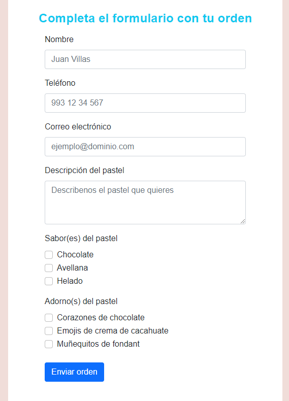

# launchx-s2-practicas

Enlace al sitio web de esta práctica: https://ricardojcruz.github.io/launchx-s2-practicas/

Este repositorio contiene las prácticas de la segunda semanda de la Mision FrontEnd de Launch X.

En esta semana se estudio HTML y las prácticas consistieron en maquetar páginas web en HTML para una pasteleria.

## Pastelería

**Maquetación**
- [Página principal](./index.html) donde el cliente puede ver información sobre pastelería y contiene un botón para ir a la página de pedidos 
- [Pedidos](./cliente.html) donde el cliente puede ver los ingredientes disponibles ordenar un pastel, se encuentra un formulario donde puede poder los detalles de su pastel deseado, así como su información de contacto.
- [Inventario y pedidos](./pastelero.html) que es una página para el pastelero encargado de hacer los pasteles, donde puede ver la cantidad de ingredientes que le restan y los pedidos que los clientes han solicitado a través de la páginas

## Prácticas

Se utilizaron (con permiso del dueño) el logo e imagenes de pasteles, así como información de contacto de una pastelería existente en la vida real.

Se aplicaron [estilos css](./styles.css) escritos por uno mismo y también se utilizaron elementos de bootstrap v5 para dar una apariencia más agradable a la páginas.

La navegación se describe a continuación:

1. El usuario entra al sitio web y ve la página principal, el usuario puede dar clic al botón de "Hacer pedido" que lo llevará a la página con esa funcionalidad.

2. El usuario puede rellenar el formulario de pedido y enviarlo para que la orden se envie a la pastelería.

Para que el pastelero entre a su página puede ir al footer y acceder mediante el link "Pastelero", de ahí será enviado a la página de Inventario y pedidos

### Creditos de imagenes

Las siguientes imagenes se utilizaron:

https://www.instagram.com/cocinagiaa/?hl=es-la

https://unsplash.com/photos/-E4yPDz8AOs

https://unsplash.com/photos/TzN2odwnesg

https://unsplash.com/photos/iT4qcNMhYTQ

https://unsplash.com/photos/ZCviVBuvFy0

https://unsplash.com/photos/B-j277apkPg
